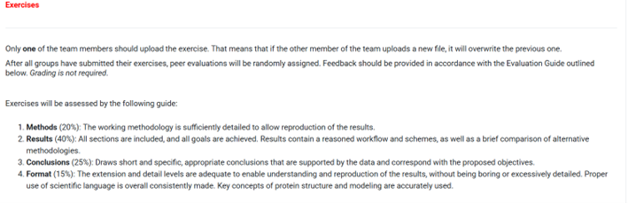

EX.1 PARSING PROTEIN STRUCTURES - 4 marzo

Formato: Python, R, bash… lo que queramos.
El objetivo de la práctica es:
-	Trabajar con el formato de archivos pdb
-	Entender cómo se fabrican y la utilidad de los mapas de contacto

Hay que coger las tres estructuras (que son bastante diferentes) y hay que hacer un pequeño script para:
-	Parsear los pdbs \
-	Sacar una tabla de metadatos con la info imp de la proteína \
-	Con las coordenadas, calcular distancias cuadráticas y hacer los mapas de contacto\above

(Es decir, cogemos las coor x y z de carbonos afla – aplicar formula – umbral de entre 6-8 Armstrong (usar 8!) y calcular los contactos) \
-	Por ultimo, interpretar un poco los plots y ver si se identifica lo mismo conel mapa que hemos generado que viendo la estructura

La idea es que nosotros hagamos la FUNCIÓN (def fx), luego NO sirve usar una función de biopython, y tampoco que lo haga chatgpt
Una vez entregada, se da una de los compañeros para evaluarla (peer review)

OJO --> La entrega supone que participamos la revisión por pares (si no queremos participar, no entregamos, se entrega solo la final)

COPIADO DE LO QUE DIJO AL PRINCIPIO - IMPORTANTE: 
hay que ir apuntando lo que hacemos día a día (NO al final) y no poner cosas en lenguaje coloquial. 
Dos rondas de entrega: 
- correción por pares: tienes que hacerlo bien para que te de el 5% extra \
- corrección profesor: solo esta es evaluable \

En las instrucciones pone que se valora el formato (results – all sections are included) así que pondría un:
- INTRODUCCIÓN/PROBLEMÁTICA \
- MÉTODOS \
- RESULTADOS \
- CONCLUSIONES
